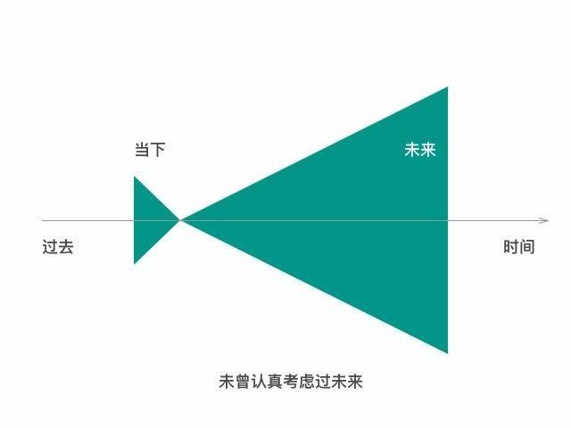
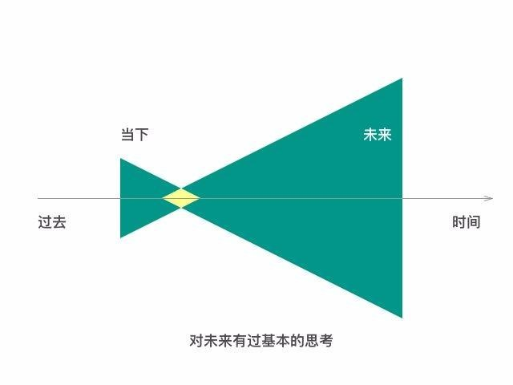
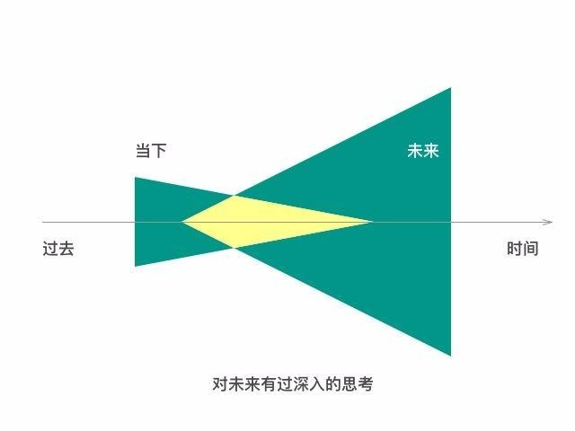

### 生活的根基

“活在当下”，是个俗世中非常流行的建议，这个建议甚至可能曾使我们这里的很多人感动的热泪盈眶。可若是你认真的反复读过下面这句话之后……

* 被困在永恒的当下……

那感觉就像：

* 由于这句流传甚广的“名言”，大部分人从来没思考过如何活在未来，他们可能甚至都不曾相信自己有机会活在未来。

* 因为缺乏这方面的思考，他们的当下和未来其实两个对立的时空，彼此没有任何的交集。

看到了这幅图，你还会觉得“活在当下”是个好建议吗？我猜你不会。我猜你会毛孔骤然收紧，猛打几个寒颤，并且脑子里有个声音说，“我绝对不应该把自己困在永恒的当下！”难道没有吗？

过去，现在，将来。

有没有办法“活在未来”呢？答案是肯定的：【有】。事实上，我们不仅有办法“活在未来”，我们也必须“活在未来”。对，就是必须，否则没有出路。因为“活在当下”，就是被永恒地困住，“活在过去”，那就是相当于被永恒地困在更差的地方。所以，即便是挣扎也要活在未来，哪怕“部分或在未来”。

怎样活在未来呢？其实这个词听起来有多玄，做起来就有多简单：

* 1.你对未来有个预测；

* 2.那个预测需要时间才能得到结果；

* 3.你笃信你的预测是正确的；

* 4.于是你提前按照那个预测的结果行动、选择、思考；

* 5.你终将走到那个结果出现的时刻；

* 6.最终证明你的预测是正确的；

* 7.那么，由于你提前按未来正确的结果行动、选择、思考，于是，在相当长一段时间里，你的生活中的一部分，就是“活在未来”的。

预测，是少数人才能掌握的能力。理由之前也说过，大多数人其实是不肯放弃百分之百的安全感的，于是，他们不肯放弃全视角，于是他们无法长期深入地关注、思考任何问题，于是，别说预测了，他们没有过去，他们没有未来，他们其实甚至连“当下”都没有——你细想想，“当下”这个概念并不是独立存在的，它实际上是相对于“过去”和“将来”才有意义的概念。更准确地讲，他们其实“只不过是就那样存在着”而已。

* 其实哪怕你意识到自己有机会活在未来，并因此对未来做出了一定的预测，都已经开始拓宽了当下的宽度。

* 看到了吗？只要你站在现在的起点，做一点基本的思考，你就已经向未来迈出了一小步。虽然并不遥远，但这已经是质变了，不是吗？

* 在这个过程中，你会受到很多外界的阻力，这些都是正常的，大部分企图“活在未来”的人都会刺激到“活在当下”的人。

* 不要对别人的鼓励，抱有太多的期待，只有把这部分的支持都当做额外赠送的，你才有机会扛过开始阶段的困难。

我们想一起看一个很简单的预测：

长期来看，脑力产出率一定比体力的产出率高，且高出许多个量级……

体力增长的玻璃顶很明显，脑力增长的玻璃顶不知道在哪儿……

体力衰退的时间来得很早，脑力衰退的时间来得晚很多……

通过暴力可获得的暴利正在减少，因为大趋势上来看，一定是知识更可能产生更大的暴利……

也许你会想，现在这不是明显的事儿吗？这算是什么预测？

这是上个世纪八十年代中期，我还在读初二的时候，日记本里写的东西（措辞稍微做了调整）——那时候我天天泡在延吉市青少年宫摆弄那台只能跑BASIC编程语言的R_1计算机……

许多年后再看笔记本里的这些记录，知道这一点都不是“惊为天人的大智慧”——这些话实际上都不是我自己想出来的，而是从书上、杂志上看来的……上个世纪整个八十年代，媒体上的主流论调之一就是：

知识就是力量。

科技就是生产力。

我当时甚至并不在意“知识就是力量”究竟是谁的名言，也没有纠结过Power究竟应该指的是“权力”，还是“力量”；只是想来想去，认定这道理是对的，一定是对的，于是笃信。

既然我相信这个道理是对的，那么，即便眼见着当时还看不到明显的效果，但我也能猜得出，在未来，也许是不远的未来，也许是很远的未来，那效果一定会明确而有显著。

那怎么办？不管别人怎么说，我笃信这个道理，于是我就只能按照这个道理所指引的方向以及方式行动与生活。

到了2005年，读 Steven D.Levitt 的 Freaconomics （中译《魔鬼经济学》），其中提到，纽约的黑帮现在已经赚不到多少钱的同时要冒很大的生命危险，不禁哑然失笑；想起来这其实是二十年前的论断之一，现在结果非常清楚。到了2013年，我陆续认识了很多游戏行业的大咖，于是经常慨叹，那些黑帮成员要是知道那些九零后的程序员是怎样写游戏赚钱且无生命危险的，估计都得羞愤的七窍流血……

这周收到了很多读者的留言，都表示自己也希望根据预测活在未来，但是迟迟不敢迈出那一步。

”知识就是力量“。当固有的知识成为你的牵绊的时候，它的力量也不小。

这个时候，大家不妨像我一样，把七年看成是一辈子。这辈子自有它精彩的部分，下辈子也有很多可能性在等着你。

就像现在很多电影里，古惑仔卖的都已经不是白粉，而是奶粉了。即便是那些看似凶神恶煞的黑帮们，最终也只能被时代拖着走，不想改变都不行。

每个领域的积累固然非常重要，但是心态上不应该轻易把自己限制住。

许多年后，再想起这个事情，我的体会是：

在知识积累这方面，我确实做到了“活在未来”。

因为许多年来，我确实一直在用知识赚钱，讲课，写书，投资，创业，都是靠知识的，且靠不断习得、不断改进、不断积累才能产生意义的知识。

而这只是生活中的一部分，剩下的大部分，尤其是“肉身”，当然一直“活在当下”——而肉身这个东西，也只能活在当下。所以，我所说的“活在未来”，本质上来看，只能是“思维上的活在未来”。

你看，甚至不需要预测，只需要认真对待那些简单、朴素而又深刻的道理，若是经过思考认为他们是正确的，那么就要笃信，并且按照那些道理践行自己的生活，那么终究有一天那些道理就好像是“显灵”了一样，明确无误地证明给你看，“你就是做到了在相当长一段时间里，别人在困在当下的时候，你活在未来”。

几乎所有人都能说出“知识就是力量”，但最终大部分人并没有因此获得太多的改变。之所以这样是因为：
* 大部分人只停留在“想一想”的阶段。

而这背后更深层次的原因则是：
* 因为没有做过深入思考，因此无法“笃信”自己的预测。

对，就是要“笃信”才可以，相信都没有用，必须是笃信。

看看那些对未来有深入思考的人都活在什么样的世界吧。

随着你思考的深入，所谓的“当下”和“未来”的重合将越来越大，这个时候你想要不活在未来估计都不可能，因为你已经“笃信”自己看到足以改变自己人生轨迹的未来。

这就像你知道了下期彩票的中奖号码，你怎么能够忍住不去买彩票呢？

我总觉得，即使每个人的肉身都活在当下，但每个人的世界还是很不一样的。因为思考质量不同，他们其实生活在完全不同的世界里。

我可以再举一个例子，一个在2016年8月份之前展望未来的预测。

经过整个2014年的思考，到了2015年上半年，我基本上得出了以下几个结论：

* 1.貌似消失了的各种社群一定会卷土重来。

* 2.新生代的社群的数量肯定会超过上一代社群的数量。

* 3.新生代的社群，免费的将逐步被收费的超越。

* 4.以交易为核心的风险将逐步超越以信息为核心的分享。

* 5.可能成为社群壁垒的大抵上应该是收费与内容积累。

于是，我开始跟身边的朋友说，收费时代来了，社群会逐步重新火起来……说了很久，其实没几个人搭理我的——真的没几个。于是，我反正闲着也是闲着，就于2015年8月份开通了微信公众账号（很多人都在说，微信公共账号的红利期早就过去了）；到了10月底，积累了大约4万个订阅用户；而后随即11月份我就开始动手搭建各种收费社群，也帮身边的一些朋友设计搭建……甚至组建了一个团队，开发一个可以作为社群工具的基础设施……而新生大学，就相当于一个样板间，谁要是有本事能建一个社群，那我就给谁复制一份，我们一起合作创建运营收费社群。

再过一两年，收费社群成为常态的时候，到时候大家就能够清楚地认同了。于是，在这个层面上，李笑来又一次做到了“活在未来”。

请千万注意：我的预测并不一定正确。事实上，我自己知道自己预测成功的历史数据没多好看。但“不确定性”是不可消除的，于是，我只能按照逻辑行事。再过一两年或是很多年，若是收费社群并未形成常态，免费还是没有被超越，那我就在这个层面上没有做到“活在未来”，或者说，“活在了错误的未来”……可那又怎样呢？反正我这种人早就放弃了“百分之百的安全感”。

关于预测，我其实并没有一个“万能公式”给大家。就像我做老师的时候，从来也不给学生模板一样。

尊重事实，相信逻辑。能做好这两点已经非常不容易。我们有太多的认知偏差需要注意，太多的固有观念需要修正。

更重要的是：
* 不要期望一次就能预测对。

实际上，只要你预测的次数足够多，就会发现一个真相：想要预测准确真的很难。

开始的时候不要怕犯错，每次失败过后要学会总结经验——哪些数据收集的不够完善，那些逻辑链条推理的不够缜密——这些都是为以后更准确地预测做的准备。

活在未来这事儿，一辈子做到一次，就很开心了，收货不可想象了——可问题在于，一旦开启了这种模式，一旦有一次清楚的成功，后面就停不下了，因为做到越来越容易，越来越自然，乃至于最终只能在思维上“活在未来”。

读到这里，我们可以一起做一个预测：
最终，活在未来的人一定比活在当下的人有更多的财富。

道理很简单啊：

所谓的投资，无非就是用现在的资源换取未来的资源。

这一周的话题，活在未来，其实是以后我们经常会重新回顾，再次展开，而后还要反复来过的基础话题。请保持耐心——尤其是对“突然之间有很多疑惑”带来的不适感的耐心。
